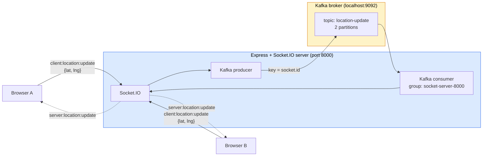
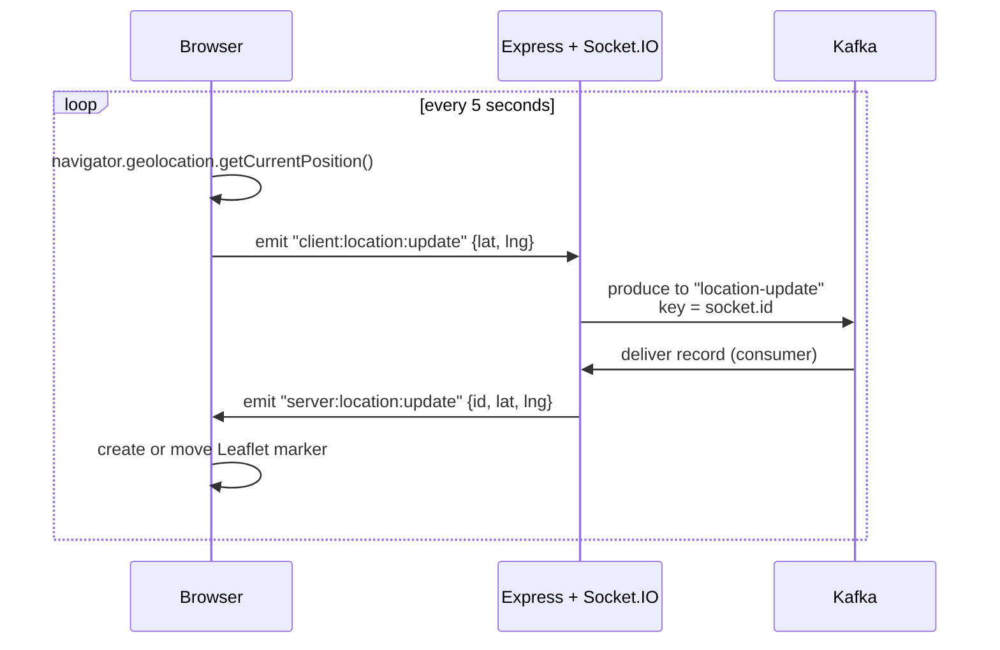
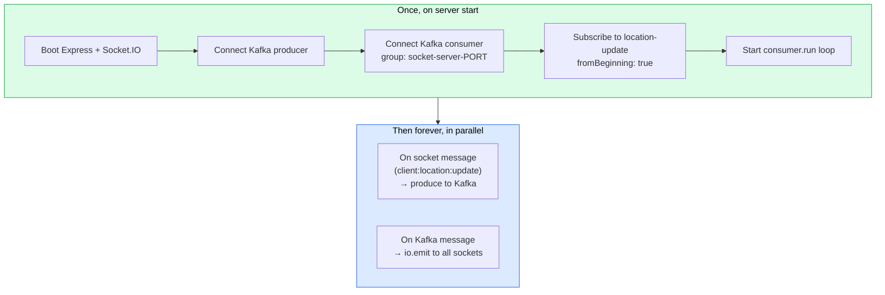

# Kafka Location Tracker

A small project I built to learn Kafka by actually wiring it up. It's a live location sharing app: open the page in two browsers, allow location access, and each browser's pin moves on the other's map in real time. The interesting part isn't the map. It's that every location update flows through Kafka before getting broadcast back out.

## What's actually happening

Every 5 seconds, each browser grabs its GPS coordinates and sends them to the Express server over Socket.IO. The server doesn't broadcast directly to other browsers. Instead, it produces the location to a Kafka topic. A consumer running inside the same server process reads from that topic and fans the message back out to every connected Socket.IO client. The browsers then drop or move a Leaflet marker on the map.

It feels like overkill for one server, and that's kind of the point. Once the server talks to Kafka, you can run multiple server instances and they all stay in sync without knowing about each other.

## Architecture



The dotted arrows at the end are the broadcast. When the consumer reads a message, it calls `io.emit(...)` which sends to every connected socket, including the one that originally sent the location.

## The flow, step by step



## Files

- `kafka-client.js`: one shared `Kafka` instance. `clientId` is `kafka-learn`, broker is `localhost:9092`.
- `kafka-admin.js`: run once to create the `location-update` topic with 2 partitions.
- `index.js`: Express + Socket.IO server. Holds both the Kafka producer and the consumer.
- `public/index.html`: Leaflet map, Socket.IO client, and the geolocation polling.
- `docker-compose.yml`: single node Kafka on `localhost:9092`.

## Running it

You need Docker, Node 16+ (tested on v24), and pnpm or npm.

```bash
# 1. start Kafka
docker compose up -d

# 2. install deps
pnpm install

# 3. create the topic (one time only)
node kafka-admin.js

# 4. start the server
node index.js
```

Open `http://localhost:8000` in two browsers (or two devices on the same network) and allow location access. You should see two markers moving.

Health check: `GET /health` returns `{ "healthy": true }`.

## Code logic flow

The server has two phases: a one-time startup, and then two things that run forever in parallel (handling socket connections, and reading from Kafka).



### Server side (`index.js`)

**1. Boot Express, HTTP server, Socket.IO**

```js
const app = express();
const server = http.createServer(app);
const io = new Server();
io.attach(server);
```

`io.attach(server)` is what mounts Socket.IO onto the same HTTP server Express is using, so both run on one port.

**2. Connect the Kafka producer**

```js
const kafkaProducer = kafkaClient.producer();
await kafkaProducer.connect();
```

One producer for the whole server. It gets reused for every incoming location.

**3. Connect the Kafka consumer (one group per server instance)**

```js
const kafkaConsumer = kafkaClient.consumer({
  groupId: `socket-server-${PORT}`,
});
await kafkaConsumer.connect();
await kafkaConsumer.subscribe({
  topics: ["location-update"],
  fromBeginning: true,
});
```

`groupId` includes the port so two server instances are in different groups and both receive every message. `fromBeginning: true` replays the topic from offset 0 when the consumer connects.

**4. Start the consumer loop, broadcast everything it reads**

```js
kafkaConsumer.run({
  eachMessage: async ({ message, heartbeat }) => {
    const data = JSON.parse(message.value.toString());
    io.emit("server:location:update", { ...data });
    heartbeat();
  },
});
```

`io.emit` sends to every connected socket on this server. `heartbeat()` tells Kafka the consumer is still alive so it doesn't get kicked out of the group.

**5. Handle browser connections, produce locations into Kafka**

```js
io.on("connection", (socket) => {
  socket.on("client:location:update", async ({ latitude, longitude }) => {
    await kafkaProducer.send({
      topic: "location-update",
      messages: [
        {
          key: socket.id,
          value: JSON.stringify({ id: socket.id, latitude, longitude }),
        },
      ],
    });
  });
});
```

`key: socket.id` makes Kafka route this browser's updates to the same partition every time, so they stay in order.

**6. Static files, health, listen**

```js
app.use(express.static(path.resolve("./public")));
app.get("/health", (req, res) => res.json({ healthy: true }));
server.listen(PORT, () =>
  console.log(`Server started on http://localhost:${PORT}`),
);
```

### Browser side (`public/index.html`)

**1. Connect socket and init the map (default view is Mumbai)**

```js
const socket = io();
const map = L.map("map").setView([19.11, 72.93], 13);
const remoteMarkers = new Map();
```

**2. When a location comes in from the server, draw or move a marker**

```js
socket.on("server:location:update", ({ id, latitude, longitude }) => {
  if (!remoteMarkers.has(id)) {
    const marker = L.marker([latitude, longitude]);
    marker.addTo(map).bindPopup(socket.id); // (small bug: shows local id)
    remoteMarkers.set(id, marker);
  } else {
    remoteMarkers.get(id).setLatLng([latitude, longitude]);
  }
});
```

The `id` is the sender's `socket.id` from the server. Browsers see their own location come back too, since `io.emit` broadcasts to everyone.

**3. Every 5 seconds, send my own location to the server**

```js
setInterval(async () => {
  const { latitude, longitude } = await getUserCurrentLocation();
  socket.emit("client:location:update", { latitude, longitude });
  // also update the local "You are here" marker
}, 5 * 1000);
```

`getUserCurrentLocation()` wraps `navigator.geolocation.getCurrentPosition` in a promise so it can be awaited.

## Things I want to remember

### Why the producer and consumer live in the same server file

It feels redundant at first. Why does the server send a message to Kafka just to read it back and forward it? Because once it works for one server, it works for ten. Two people can run server instances on different ports, each instance has its own Kafka consumer, both see every location, and all connected browsers stay in sync no matter which server they connected to.

### Why `groupId: socket-server-${PORT}`

This was the click moment for me. Consumer groups in Kafka work like this:

- Same group = work sharing. Each message goes to one consumer in the group.
- Different group = independent reads. Each group sees every message.

For a broadcast app like this, every server instance needs every message. So each server gets its own group ID by sticking the port number in it. If they were all in the same group, only one server would get each location and the other servers' browsers would miss updates.

### Why `key: socket.id` when producing

The key decides which partition a message lands on. Same key = same partition = guaranteed order. All locations from one browser stay in order, even with 2 partitions.

### Why 2 partitions

No deep reason, just enough to actually feel partitions in action. With 2 partitions, two consumers in the same group could pull messages in parallel, one per partition. With 1 partition there's no parallelism.

### What `fromBeginning: true` does

When the consumer subscribes, it replays from the start of the topic. Helpful in dev because you don't lose old messages if you restart the server. In production you'd usually flip this to `false` so you only get new stuff.

## Concepts cheat sheet

**Topic**: a named log. Producers append, consumers read. Mine is `location-update`.

**Partition**: a topic is split into partitions for parallelism. Order is guaranteed inside a partition, not across them.

**Producer**: writes to a topic. Optionally with a key, which decides the partition.

**Consumer**: reads from a topic. Tracks where it is using offsets.

**Consumer group**: multiple consumers under the same `groupId` share the work. Different `groupId` means independent reads of the same topic.

**Offset**: the position in a partition. Committed automatically by kafkajs. Lets a consumer pick up where it left off after a restart.

## Stuff that bit me

- `Cannot read properties of undefined (reading 'server')` from Socket.IO usually means the wrong import. It should be `import { Server } from "socket.io"`, not `Socket`.
- If `kafka-admin.js` fails to connect, Kafka isn't actually up yet. Run `docker compose ps` to check.
- "Topic already exists" errors from the admin script are fine. Just means you ran it twice.
- Default port is 8000. `PORT=3000 node index.js` if you want something else.

## Stuff I'd add next

- OIDC / OAuth login, so users have stable IDs and the marker popups can show usernames instead of socket ids.
- Run two server instances at the same time and confirm the broadcast still works end to end.
- Fix the marker popup. Right now `bindPopup(socket.id)` shows the local socket id, not the remote one.
- Skip producing if the location hasn't changed in the last 5 seconds.
